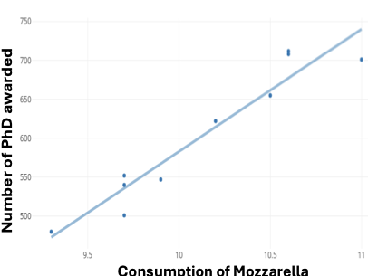
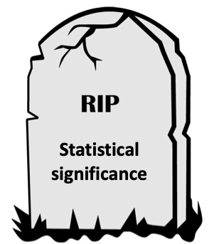

## Why are you here?

A.  I Have to attend to get the certificate

\vspace{.5cm}

B.  I Want to learn about evidence synthesis

\vspace{.5cm}

C.  The weather is not good outside. I need an air-conditioned place to spend the day

## Objectives

-   To spot misinformation \vspace{.5cm}

-   To find what works in healthcare \vspace{.5cm}

-   To produce trusted evidence \vspace{.5cm}

## Why am I here?

{width="500"}

## The infodemic

Misinformation has become an epidemic

We must use explicit, planned methods to identify, appraise, & summarize empirical research to answer specific questions

1.  Prevalence
2.  Etiology
3.  Diagnosis
4.  Therapy
5.  Prognosis

## Evidence to Decision

## Common sense vs non-sense

{width="364"}

## The Ivermectin hoax

-   Fabricated RCTS

-   Flawed systematic review

## Process of producing trusted evidence

## Clinical significance

## Clinical significance

::::: columns
::: {.column width="60%"}
-   Real Clinicians make clinical decisions

-   CLINICAL significance

    -   the accuracy of the diagnostic test or the size of a treatment effect

    -   the severity of the condition being diagnosed and treated

    -   the undesirable consequences of the diagnosis and treatment
:::

::: {.column width="40%"}

:::
:::::

## Quiz

-   Clearly Write your ID.

-   Write the definition of bias.

-   Mention one type of bias.

-   In one sentence, explain a strategy to prevent this type of bias.

## Thanks, see you soon

