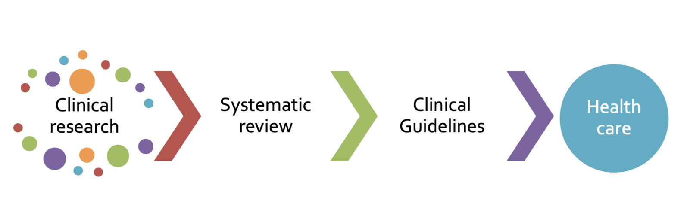
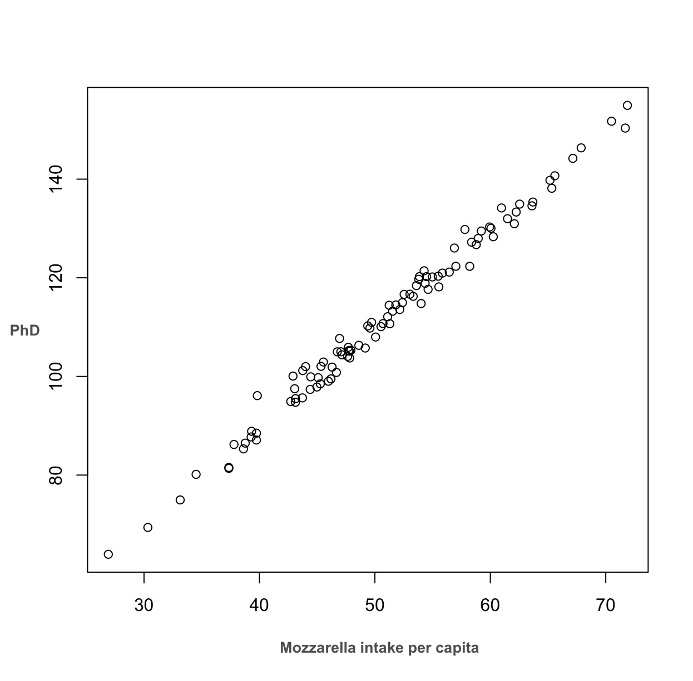
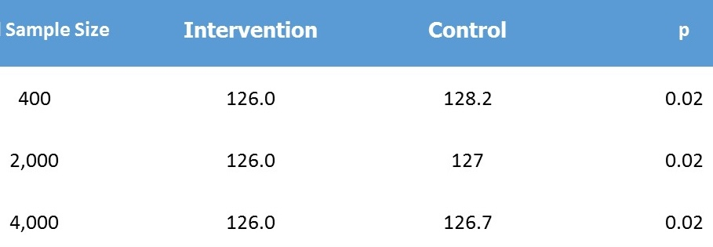
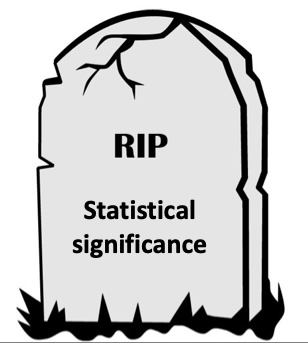

## I am here

-   To spot misinformation \vspace{.5cm}

-   To find what works in healthcare \vspace{.5cm}

-   To produce trusted evidence \vspace{.5cm}

## The scandal of medical research

{fig-align="center" width="500"}

## The infodemic

Misinformation has become an epidemic

We must use explicit, planned methods to identify, appraise, & summarize empirical research to answer specific questions

1.  Prevalence
2.  Etiology
3.  Diagnosis
4.  Therapy
5.  Prognosis

## Evidence to Decision

{fig-align="center" width="528"}

# The non-sense

## Mozzarella for PhD

{fig-align="center" width="310" height="260"}

## **The Parachute enigma**

{fig-align="center" width="466"}

## The Ivermectin hoax

-   Fabricated RCTS

-   Flawed systematic review

## Clinical vs statistical significance

## Real Clinicians make clinical decisions

::::: columns
::: {.column width="60%"}
\vspace{.5cm}

-   The size of a treatment effect \vspace{.5cm}

-   The severity of the condition \vspace{.5cm}

-   The balance between benefits and harms
:::

::: {.column width="40%"}
{width="200" height="225"}
:::
:::::

## Process of producing trusted evidence

{fig-align="center"}

## **See you next week**

> **Cheers**
