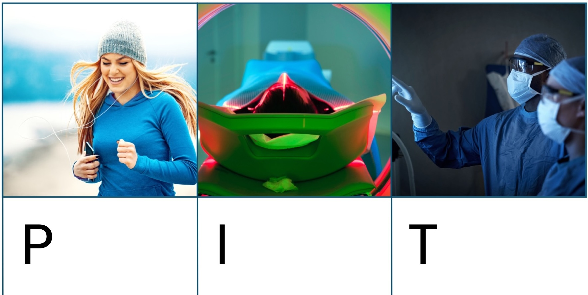

## No correct Answer to a wrong Question

-   First and most important task

    -   to define each component of the question
    -   to determine the scope: narrow vs broad
    -   to inform the process (search, selection, synthesis)

-   Types

    -   Background
    -   Foreground

## Effect of intervention

## Clinical tests

## The objective

-   Precise (Specific, defined) $≠$ Narrow (restricted)

-   template:

    -   To assess the effects of \[intervention as compared to control\] for \[PRO\] in \[population\]

    \vspace{.5cm}

    -   To determine the diagnostic accuracy of \[index test\] for detecting \[target condition\] in \[population\].

## The four corners debate

-   Choose a relevant health issue

-   Draft a well formulated question

-   Write a clear objective of the synthesis

## **See you next week**

> **Cheers**
