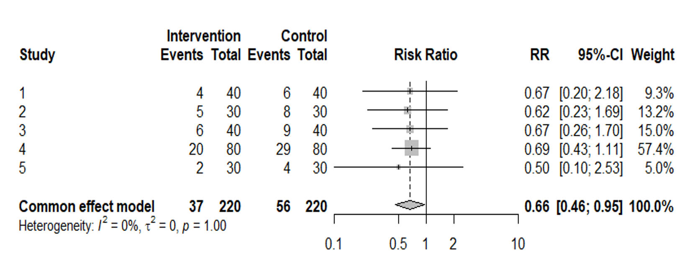
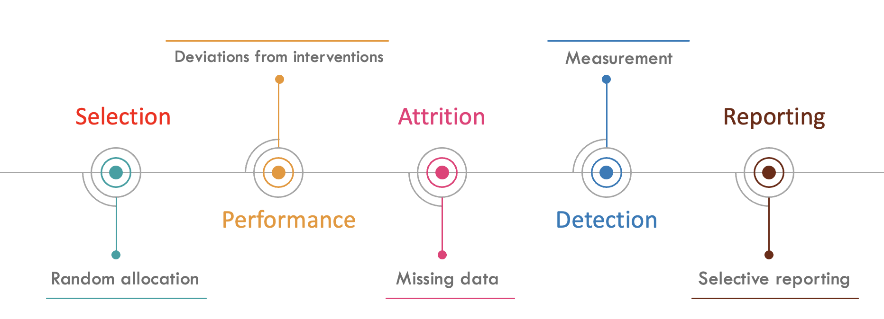

# Feedback

-   Quality of reporting: PRISMA-S checklist

-   Peer-review of search strategy: PRESS checklist

# The Fraud

## Trash synthesis

-   In an era of perverse academic incentives, the publication of ***redundant***, ***flawed***, ***misleading***, ***conflicted*** synthesis of evidence

    -   has reached epidemic proportions

    -   is a major threat to

        -   credible science

        -   quality healthcare

## Trash synthesis

# Bias in clinical research

## Bias

-   A systematic error

    -   Primary studies

    -   Synthesis

-   Overarching groups

    -   Selection bias

    -   Information bias

## Risk of bias in trials

## Risk of bias in DTA

-   Selection bias

-   Spectrum bias

-   Misclassification bias

-   Partial Verification bias

-   Differential verification bias

-   Disease progression bias

## Tools to assess the risk of bias

-   Cochrane RoB 2

-   QUADAS 2

# Thank you
