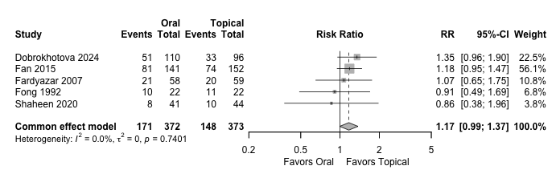
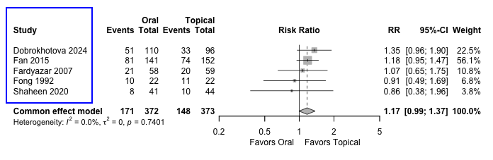
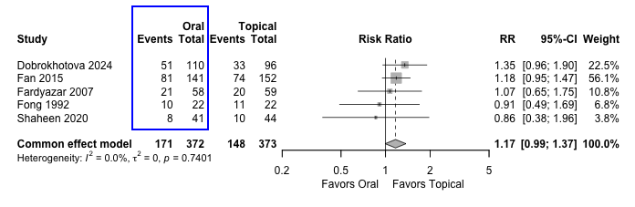
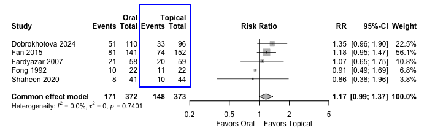
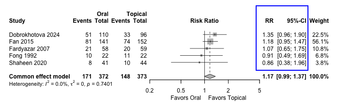
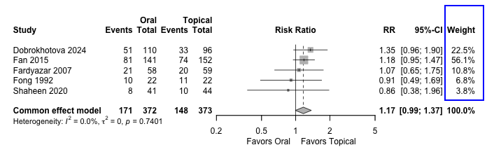
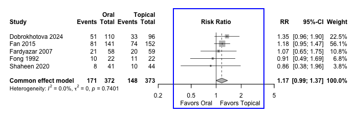
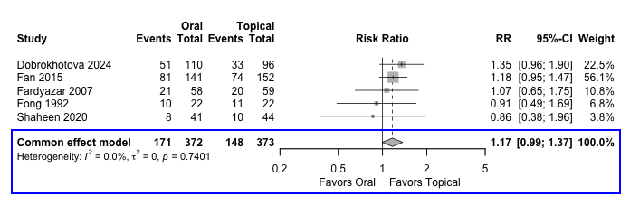
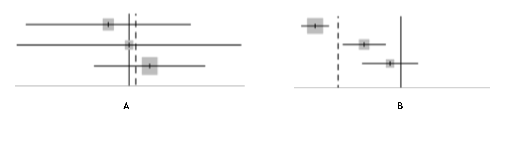

# The Plot Explained

## State-of-the-art example

## The outcome

-   Recurrence of vulvovaginal candidiasis at the end of follow up

-   A binary outcome

    -   Numerical: point estimate (RR) for each study, then pooled summary (Weighted average).

    -   Graphical: Forest plot

## The Plot

## The Plot

## The Plot

## The Plot

## The Plot

## The Plot

## The Plot

## The Plot

## Eyeballing to detect heterogeneity

# Thank you
