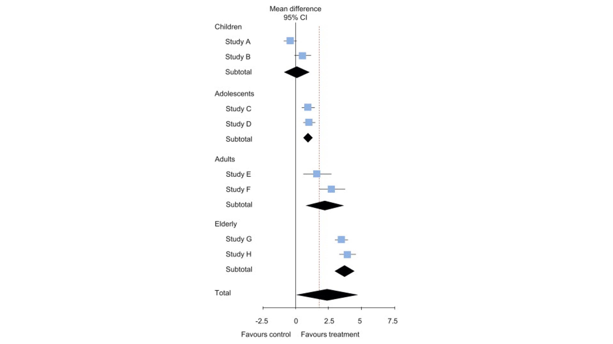

# Heterogeneity

## **What is heterogeneity?**

-   Factual

-   Conceptual

    -   Clinical

    -   Methodological

    -   Statistical

## **Identifying and measuring heterogeneity**

-   Graphical

-   The chi-squared test

-   The *I*^2^ test

## **Strategies for addressing heterogeneity**

-   *Check again that the data are correct.*

-   *Do not do a meta-analysis.*

-   *Explore heterogeneity.*

-   *Ignore heterogeneity.*

-   *Perform a random-effects meta-analysis.*

-   *Reconsider the effect measure.*

-   *Exclude studies.*

## Knowledge that makes a difference

{width="441"}

# Cheers
