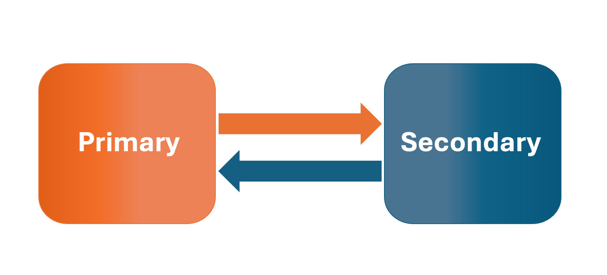
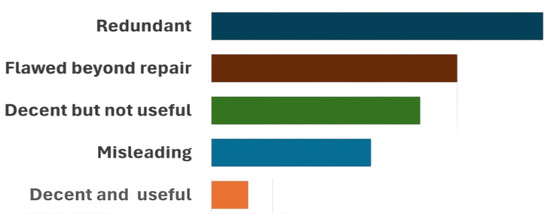
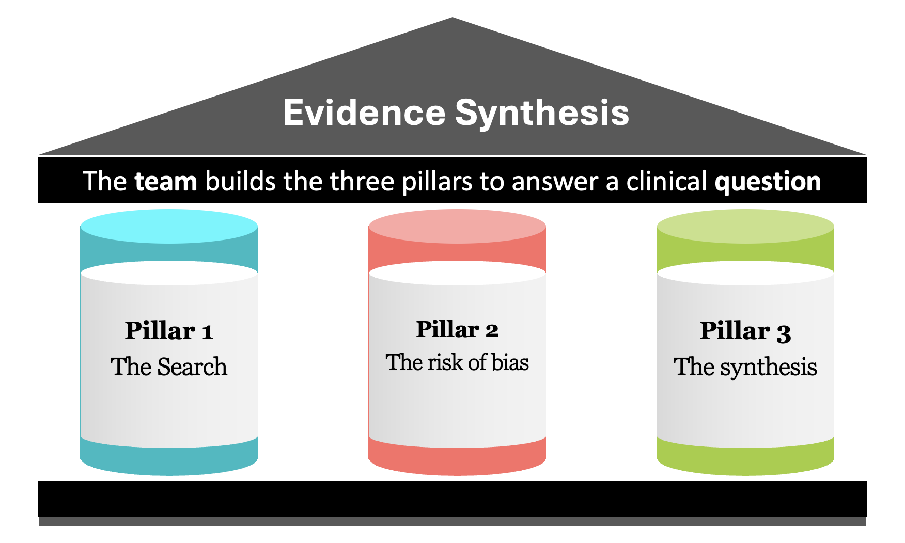
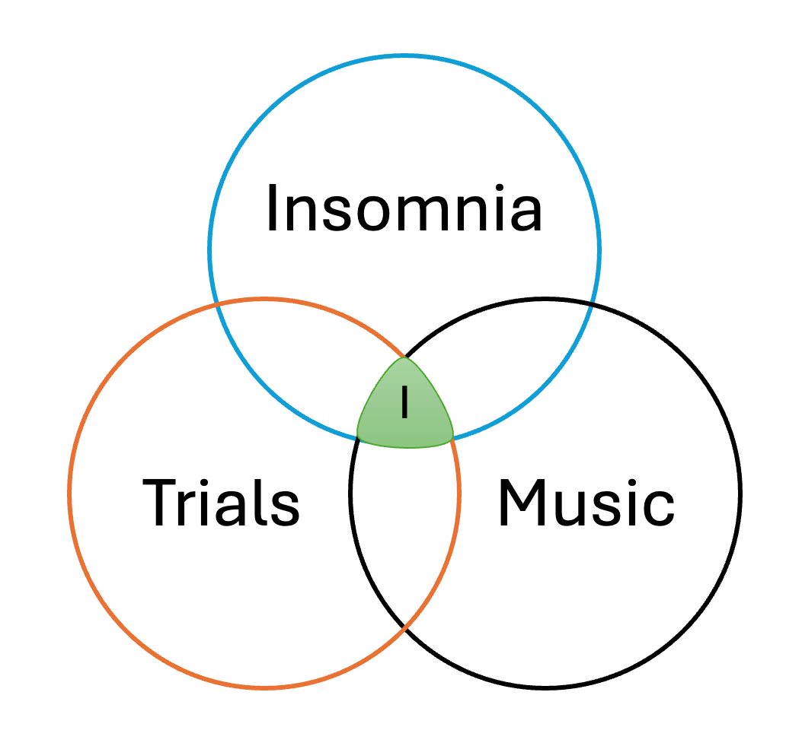
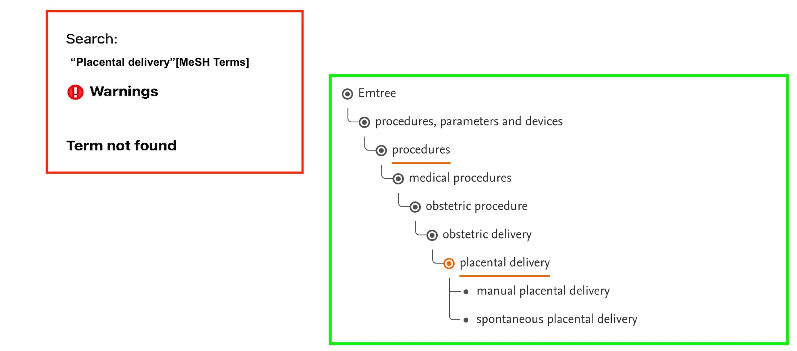
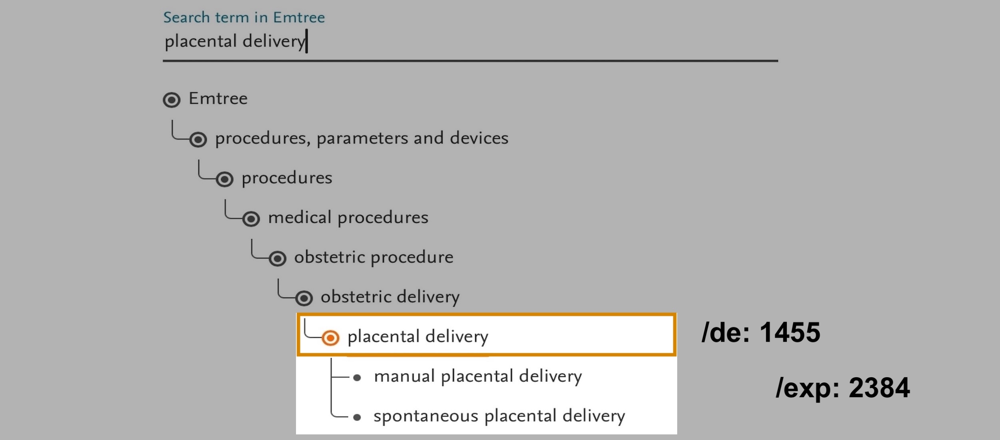
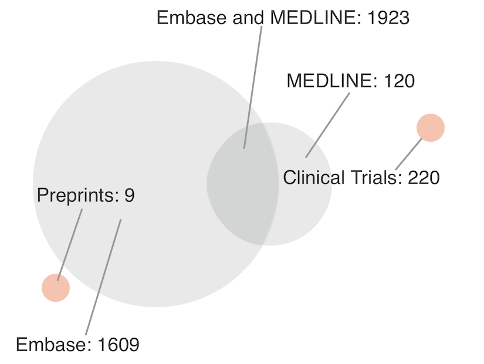
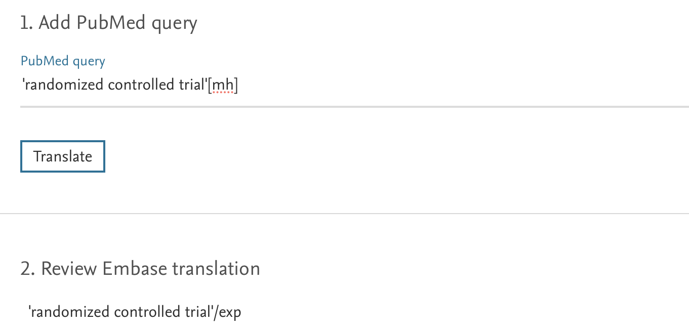
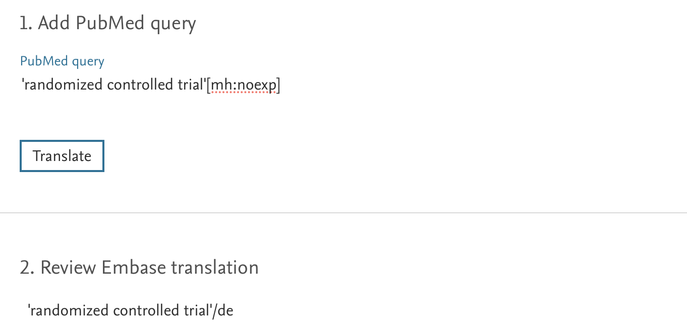
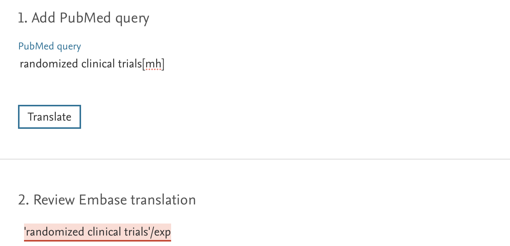

# The art of Evidence Synthesis

## I am here because

-   It is cold outside and I need a warm place to have my coffee \vspace{12pt}

-   I seek to acquire reliable, scientifically grounded knowledge \vspace{12pt}

## Endgame 1

\Large Write a question where the correct answer can only be **Embase**

## Synthesis for informed decisions

{fig-align="center" width="440"}

## Status quo

{fig-align="center" width="494"}

## Pillars of a decent and useful synthesis

{fig-align="center" width="70%"}

## The team

-   Plans a detailed protocol

-   Conducts a valid synthesis

-   Must include

    -   A **subject area** expert

    -   A **methodology** expert

## The question

-   \small What is the prevalence of depression among resident physicians working in tertiary hospitals in LMIC? \vspace{18pt}
-   \small In women with AUB, what is the accuracy of TVUS endometrial thickness measurement for detecting EC? \vspace{18pt}
-   \small In adults with insomnia, is listening to music, compared to usual care, effective in improving sleep quality?

## The methods

-   Systematic: planned, methodical, structured, meticulous, coherent

    -   The search: ***structured*** and comprehensive

    -   The risk of bias assessment: ***meticulous*** and accurate

    -   The synthesis: ***coherent*** and robust

-   Today, I shall focus on ***the search strategy***

# The search strategy

## Endgame 2

\Large cesarean AND ampicillin OR ceftriaxone

## Essentials

-   A thorough, objective and ***reproducible*** search \vspace{12pt}

-   An ***expert*** ***plans*** the search strategy \vspace{12pt}

-   An independent ***expert*** ***reviews*** the search strategy

## Concepts

::: {layout-ncol="2"}
-   Health condition (population) \vspace{18pt}

-   Intervention \| Index test \vspace{18pt}

-   Study design

{fig-align="center" width="215"}
:::

## Terms

-   Determine the appropriate controlled vocabulary \vspace{18pt}

-   Find and use a wide variety of synonyms and spelling variants.

## Fields

|      |                                                                |
|------|----------------------------------------------------------------|
| /exp | an exploded index term (Emtree indexing term) \vspace{6pt}     |
| /de  | an index term (descriptor) (Emtree indexing term) \vspace{6pt} |
| :ti  | a word in the article title \vspace{6pt}                       |
| :ab  | a word in the abstract \vspace{6pt}                            |
| :kw  | an author keyword                                              |

: {tbl-colwidths="\[10,90\]"}

## Structure

-   **Must** search controlled vocabulary **combined with** predefined free text fields

-   **NEVER use All-fields search**

    -   All fields search is **NOT** structured, **NOT** reproducible

    -   In practice it leads to [**lower recall**]{.underline} (missing relevant items)

## Logic

-   Boolean operators \vspace{12pt}

-   Ensure correct use of the ‘AND’ and ‘OR’ operators. \vspace{12pt}

-   Avoid the ‘NOT’ operator in combining search sets.

## Proximity operators

-   NEAR/n - searches in either direction.
    -   **e.g. carcinoma** NEAR/3 **breast:** 126942 \vspace{18pt}
-   NEXT/n - the first term must come first
    -   e.g. **carcinoma** NEXT/3 **breast:** 17268
    -   This finds “carcinoma of the breast” but NOT "breast carcinoma".

## Truncation

-   Use an `*` to find multiple endings:

    -   e.g., hypoglycem\* returns [hypoglycem**ia**, hypoglycem**ias**, hypoglycem**ic**]{.underline} \vspace{18pt}
    -   Be careful: biops\* returns biopsy, biopsies, biopsied, biopsychology, biopsychiatry, biopsychosocial, ... etc

## Wildcard

-   Use a `?` as a ***wildcard*** to search for letter variants within a word

    -   e.g. wom?n finds women and woman

## Information sources

-   Medical Bibliographic Databases: **Embase**, MEDLINE

-   Citation databases: e.g. Scopus, WoS

-   Trial registries

-   Grey-literature

# Embase

## Emtree

-   The controlled vocabulary of Embase \vspace{12pt}

-   **103,204 preferred** terms (Nov 2025) including MeSH terms \vspace{12pt}

-   **Over 550,000** synonyms

## Emtree vs MeSH

{fig-align="center" width="499"}

## exp vs de

{fig-align="center" width="477"}

## Controlled vocabulary + free-text fields

|     | Query                                | Results            |
|-----|--------------------------------------|--------------------|
| #1  | 'placental delivery'/exp             | 2392 \vspace{12pt} |
| #2  | (placental NEAR/3 delivery):ti,ab,kw | 1820 \vspace{12pt} |
| #3  | #1 OR #2                             | 3884               |

: {tbl-colwidths="\[10,60,30\]"}

## Records per source

{fig-align="center" width="333"}

## Translation issues

\Large Every database/platform has its own operators & fields

## *Exact match* in Emtree and field code

{fig-align="center" width="460"}

## *Exact match* in Emtree and field code

{fig-align="center" width="460"}

## No exact match

{fig-align="center" width="460" height="220"}

## No translation for the term or field code

{fig-align="center" width="460" height="220"}

## Peer review

-   Database name, stating the platform for each
-   Full search strategy for each database
-   Filters (e.g., study design)
-   Boolean and proximity operators
-   Both free-text and controlled vocabulary **MUST** be used.
-   Synonyms, variant spellings, truncation, wildcards

## Endgame 1

-   Questions where the correct answer can only be **Embase**

    -   The **most comprehensive** medical bibliographic database is

    -   **Emtree is the controlled vocabulary used by**

## Endgame 2

-   **Incorrect Nesting** \vspace{18pt}
-   **Using All-Fields search**

## Key takeaways

-   A flawed search strategy is typically caused by 

    1.  **Human error**

    2.  L**ack of knowledge** of information retrieval principles 

    3.  **Technical or platform limitations** \vspace{12pt}

**I shall help you with all three, because I CARE**

## 

{fig-align="center"}

## 

{fig-align="center" width="250"}
