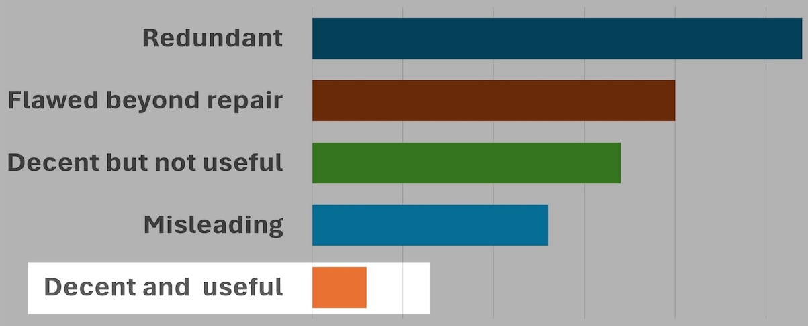
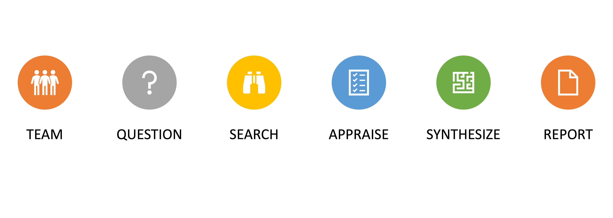
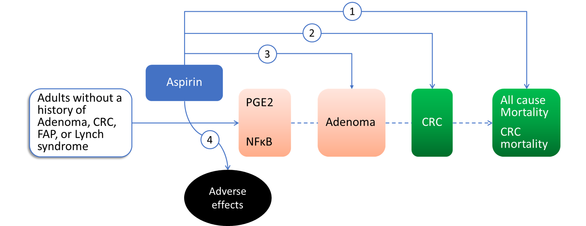

## Why are you here?

A.  I Have to attend to get the certificate for my promotion

\vspace{.5cm}

B.  I Want to learn about evidence synthesis

\vspace{.5cm}

C.  It's cold outside. I need a warm place to spend the day

## Objectives

-   To formulate a well-defined review question \vspace{.5cm}

-   To define the criteria for including studies in the review \vspace{.5cm}

-   To design a reproducible and comprehensive literature review search \vspace{.5cm}

-   To understand the concept of bias \vspace{.5cm}

-   To understand the methods for synthesizing findings from included studies

## Why am I here?

{width="500"}

# Typology of reviews

## The study of types

We MUST understand the types of reviews. **WHY**?

\vspace{.5cm}

Query: what types of reviews have you published?

## Types

::::: columns
::: {.column width="40%"}
-   Narrative

\vspace{0.5cm}

-   Systematic review

\vspace{0.5cm}

-   Mapping

\vspace{0.5cm}

-   Qualitative

\vspace{0.5cm}

-   State-of-the-art
:::

::: {.column width="60%"}
-   Systematic search and review

\vspace{0.5cm}

-   Meta-analysis

\vspace{0.5cm}

-   Scoping

\vspace{0.5cm}

-   Mixed methods

\vspace{0.5cm}

-   Overviews (Umbrella)
:::
:::::

## The review Process

# SR: The Question

## The review question

-   First and most important task:

    -   to define each component of the question

    -   to determine the scope: narrow vs broad

    -   to inform the process (search, selection, synthesis)

-   Types

    -   Background

    -   Foreground

## No correct A to a wrong Q

## Analytic framework

## The objective

-   Precise (Specific, defined) $≠$ Narrow (restricted)

-   template:

    -   To assess the effects of \[intervention as compared to control\] for \[PRO\] in \[population\]

    \vspace{.5cm}

    -   To determine the diagnostic accuracy of \[index test\] for detecting \[target condition\] in \[population\].

# SR: Eligibility criteria

## Population

-   Clinical & Demographic characteristics + SETTING

-   Consider Equity (gender, economic status … etc.)

-   Challenge: studies in which only some participants meet your criteria

## Interventions

-   Dose, route, timing, frequency, duration, etc.

-   Be clear what you mean by ‘no intervention’

-   Can remain open to any comparisons, but be explicit

## Outcomes

-   Identify meaningful primary and secondary outcomes

    -   Domain e.g. Hemoglobin

    -   Specific measurement(s) e.g. g/dl

    -   Specific metric(s) e.g. change from baseline

    -   Time point(s) e.g. 24 hours postoperative

-   Consider core outcome sets

## Study design

Select the appropriate design for the question e.g.,

-   Diagnosis: DTA studies

-   Therapy: RCTs

-   Prevalence: cross-sectional stydies

## Endgames

-   Two teams

    -   Formulate a well-defined review question

    -   Draw an analytical framework

    -   Define the eligibility criteria

## Thank you, see you tomorrow

# SR: The search

## Information sources

## Fields, explained

-   Fields may contain either free or controlled data

    -   Title \[ti\]

    -   Abstract \[ab\]

    -   MeSH terms \[mh\]

    -   Publication type \[pt\]

## Bibliographic databases

| Database | Provider  | Platform         |
|:---------|:----------|:-----------------|
| MEDLINE  | NLM       | PubMed           |
| MEDLINE  | Clarivate | Web of Science   |
| Embase   | Elsevier  | Ovid             |
| CENTRAL  | Wiley     | Cochrane Library |

: {tbl-colwidths="\[30,30,60\]"}

## Concepts and terms

-   Concepts

    -   Population

    -   Intervention

    -   Study design

-   Terms are synonyms for each concept

    -   use your knowledge or browse the mesh database

## Structure

-   Line by line format

    -   Each line = one term in one specific field

    -   Must search in both free and controlled fields

-   Boolean logic

    -   use OR to combine synonyms

    -   use AND to combine concepts

## Errors

-   Published SR: \>90% of the MEDLINE searches contained at least one search error. Errors included

    1.  inadequate translation of the strategy for different databases

    2.  spelling errors

    3.  the omission of spelling variants and truncation

    4.  incorrect use of Boolean operators and line numbers

    5.  misuse of controlled and free terms

## Peer review

-   DB name, stating the platform for each

-   Full search strategy for each DB, exactly as run

-   Limits and restrictions (e.g., language, study design)

-   Boolean and proximity operators

-   Subject headings and Text word searching

-   Synonyms, related terms, variant spellings

## Published "review"

-   They wrote "Pubmed, SCOPUS, Web of Science, CENTRAL were searched"

-   "low intensity statin\*" OR "low-intensity statin\*" OR "moderate intensity statin\*" OR "moderate-intensity statin\*"

-   Lovastatin OR Mevinolin OR “6 Methylcompactin”

## Endgames

-   Game 1: For adults with low back pain, does paracetamol compared with placebo, improve quality of life?

    -   Conceptual knowledge: Identify the concepts.

    -   Procedural knowledge: develop a comprehensive strategy

-   Game 2: Tamoxifen for Breast cancer

# SR: The Risk of Bias

## Errors in medical research

-   Random error

-   Confounding

-   Systematic error

## Classification of bias

-   Selection Bias

-   Information Bias

## Bias in clinical trials

## Rapid appraisal endgame

Take 10 minutes to assess the quality of this published work: LOVIT RCT

## Thanks, see you in our next course

