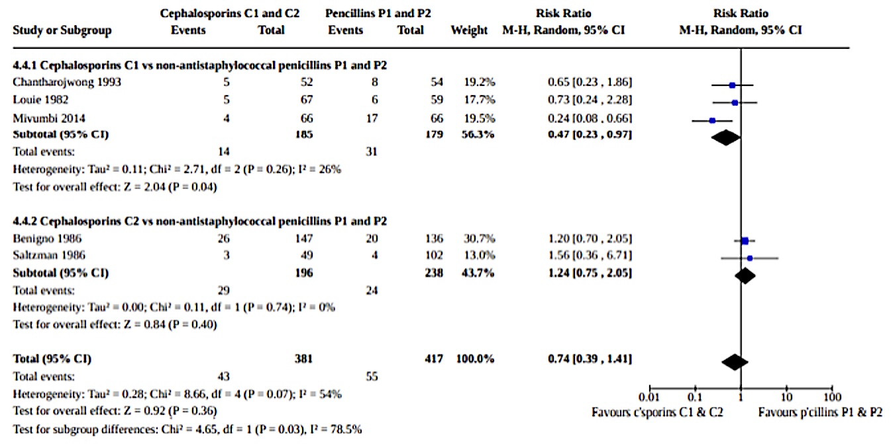
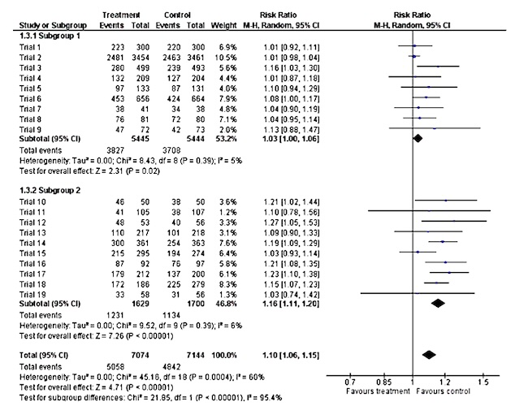

# Subgroup Analyses

## What to look for

-   Is there a statistically significant difference between the subgroups?

-   Is there a quantitative or qualitative difference between the subgroups?

-   Is there a clinically important difference between the subgroups?

-   Is heterogeneity reduced after doing the subgroup analysis?

-   Is the difference between subgroups plausible/realistic?

## Example 1

## Example 2

{width="358"}

# Thank you
